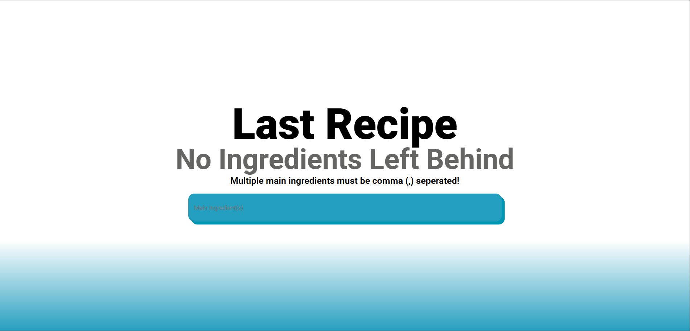
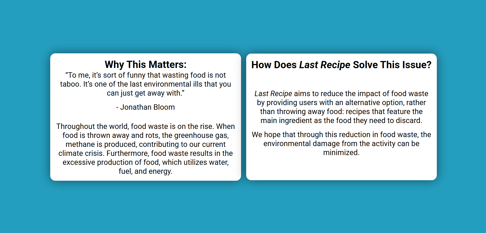
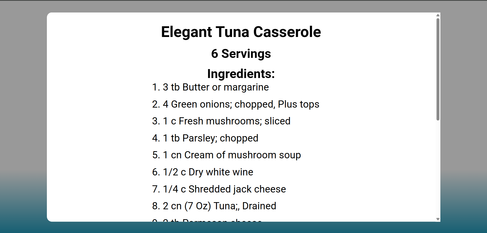
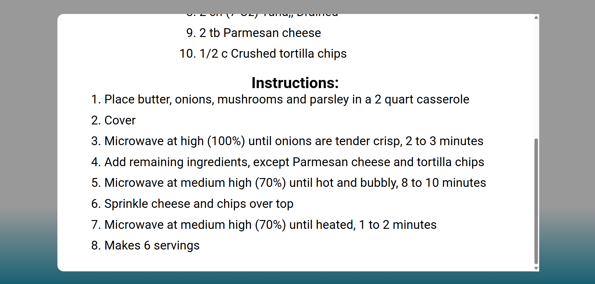

<h1 align="center" id="title">Last Recipe</h1>
<p align="center" id="subtitile">No Ingredients Left Behind</p>

## Preview

<div align="center" display="flex">
    
    
    
    
</div>

## Inspiration
I was inspired to create **Last Recipe** because I wanted to reduce food waste. Whenever my family buys ingredients for a recipe, there are always leftovers that don’t get used and eventually get thrown out. So, my partner and I decided to make a website to solve this problem.

## What it does
Our website allows users to input any leftover ingredients they have, and it finds recipes based on those ingredients. It provides a list of ingredients, cooking instructions, and serving sizes for each recipe.

## How we built it
We built **Last Recipe** using vanilla **HTML**, **CSS* and **JavaScript**. We used a public recipe API to fetch recipe data dynamically based on user input.

## Setup
Add Ninjas API Key
```javascript
 const recipeTitle = 'https://api.api-ninjas.com/v2/recipe?ingredients='+searchInput;
 const myAPIKey = 'INSERT API KEY HERE';
```

**Do not commit to your fork after this step, otherwise you will leak your API key!!**

## Challenges we ran into
One of our main challenges was designing the website to look appealing. We spent a lot of time redesigning the layout and experimenting with styles. Another big challenge was learning how to properly fetch and handle data from the API.

## Accomplishments that we're proud of
We’re proud that we managed to build a functional website using tools and technologies we had never worked with before — all within a short amount of time.

## What we learned
We learned how to use and integrate APIs safely and effectively. We also learned valuable lessons about front-end design and how to make user-friendly interfaces.

## What's next for Last Recipe
Next, we plan to add a **computer vision system** that allows users to take a picture of their leftover foods. The website would automatically recognize the ingredients and suggest recipes accordingly.
